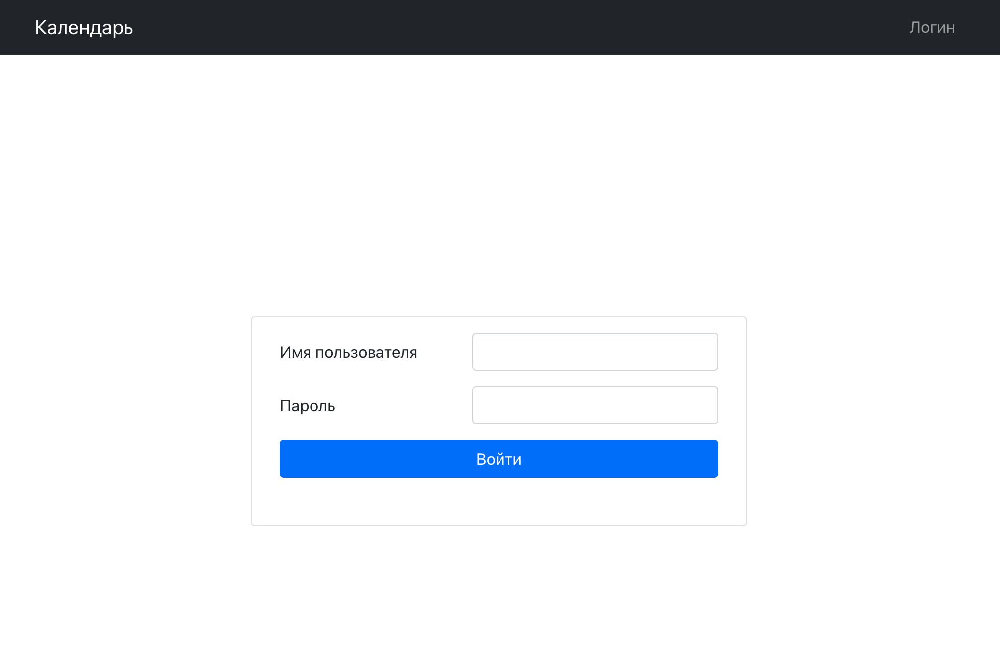
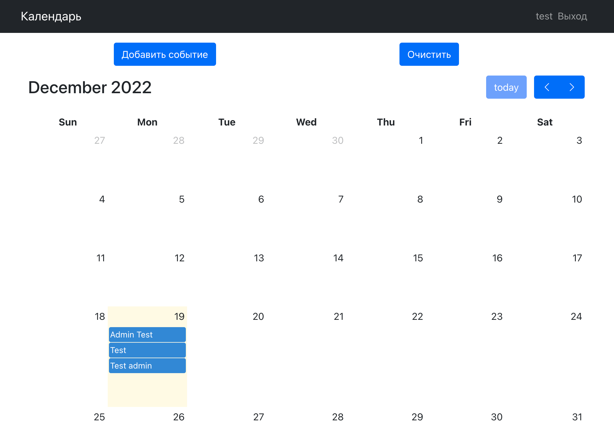
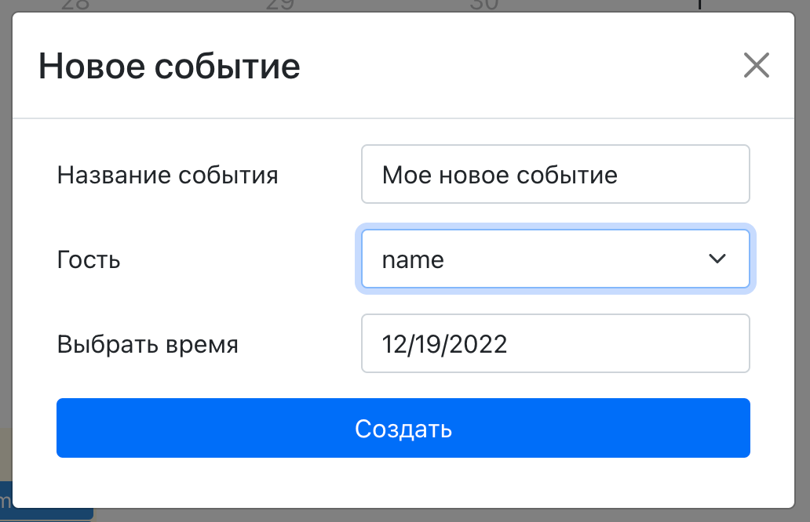

# Календарь на Solid.js



Основано на проекте из видео [React JS ПРОДВИНУТЫЙ КУРС](https://www.youtube.com/watch?v=ElaIKk8ba5g) от [Ulbi TV](https://github.com/utimur/react-profi)

# 
Стек: `Solid.js`, `TypeScipt`, `Vite`, `Solid-Router`, `Solid-Bootstrap`, `axios`, `FullCalendar`, `Soldi-Zustand`, `vanillajs-datepicker`

## Отличия в проекте
# 
 * `Solid.js` вместо `React.js` 🤗
 * Используется [Solid-Bootstrap](https://github.com/solid-libs/solid-bootstrap) вместо `And Design`
 * Заменил `Redux` на [Solid-Zustand](https://github.com/wobsoriano/solid-zustand)
 * Используется [FullCalendar](https://fullcalendar.io/) и [Vanilla JS Datepicker](https://mymth.github.io/vanillajs-datepicker/#/), так как таких компонентов в `bootstrap` нету
  

## Скрины
# 




## Как запустить?
# 
   1. Клонируем проект
   2. Ставим пакеты: `npm i`
   3. Затем делаем `build` для `Vanilla JS Datepicker`:
```bash
cd ./node_modules/vanillajs-datepicker/
npm i
npm run build
```
   4. Идем обратно в проект: `cd ../../`
   5. Запускаем: `npm run dev`
   6. ...
   7. Profit!

## Нюансы
# 
 * В `store` все `actions` и `states` намешаны одну в кучу, поскольку делал я все не через `reducers`, а через `slices`
 * `Modal` в `solid-bootstrap` не обновляет контент внутри. Скорее всего это баг у пакета, так как я проверял у `react-bootstrap` и там таких проблем не было
 * Из-за бага выше не заморачивался с валидацией в `EventFrom`
 * Из-за отличий в фреймворках не стал делать некоторые функции в `hooks`, `utils` и `api`.
 * `SASS` используется только для `vanillajs-datepicker`
 * убрал `moment` за ненадобностью 